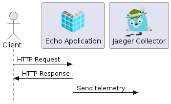
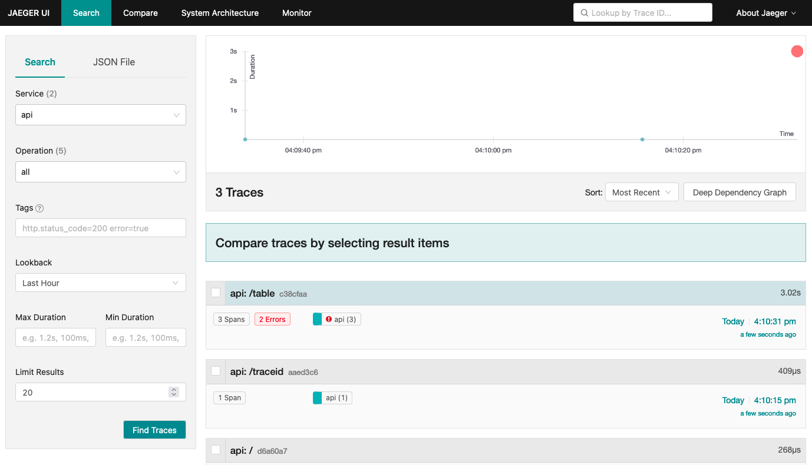
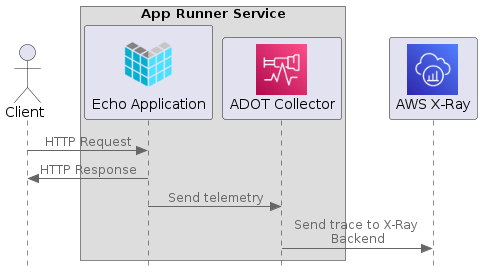
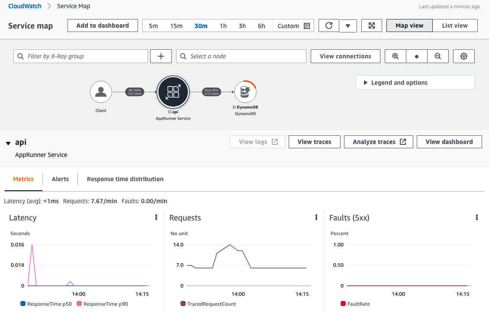

# AWS Distro for OpenTelemetry (ADOT) tracing
You can visualize traces in local environment (using Jaeger) and in AWS (using X-Ray) with AWS Distro for OpenTelemetry.

## Requirements

- AWS Account
- AWS Region: us-east-1
- Node.js (v16.17.1)
- Npm (8.15.0)
- Docker (20.10.7)
- Docker Compose plugin (1.29.2)

## Setup

```shell
npm install
# if you are new to AWS CDK
# cdk bootstrap
cdk deploy
```

## Usage(Local development)


### Edit `docker-compose.yaml`

DynamoDB table's name is printed on the terminal (`AppRunnerOpentelemetryStack.DynamoDBTableName`). Fill out `TABLE_NAME` in docker-compose.yaml.

### Visualize trace with Jaeger
Run application container and Jaeger container with Docker Compose.

```term
docker compose up
```

Make some requests to app container, and you can see traces in Jaeger UI (open browser in `http://localhost:80`).

```shell
curl http://localhost:8080/
curl http://localhost:8080/traceid
```



## Usage(App Runner)


### Register App Runner URL
App Runner URL is printed on the terminal (`AppRunnerOpentelemetryStack.AppRunnerURL`). Copy the endpoint URL.

```shell
export ENDPOINT=<App Runner URL>
```

### Health check

```shell
curl $ENDPOINT
{"Message":"Healthy"}
```

### Get trace id

```shell
curl "$ENDPOINT/traceid"
{"OtelTraceIDFromSpanContext":"6333d20502adf92d769affc6d43c461b","XRayTraceIDFromSpanContext":"1-6333d205-02adf92d769affc6d43c461b","OtelTraceIDFromGenerator":"6333d2055cd3fd9b4f576c1cb9aa863a","XRayTraceIDFromGenerator":"1-6333d205-5cd3fd9b4f576c1cb9aa863a"}
```

### Create a movie

```shell
curl -X POST "$ENDPOINT/movie" \
  -H 'Content-Type: application/json' \
  -d '{"id":1,"title": "The Time-Bombed Skyscraper"}'
{"Message":"Created new movie"}
```

### Get a movie

```shell
curl "$ENDPOINT/movie/1"
{"id":1,"title":"The Time-Bombed Skyscraper"}

curl "$ENDPOINT/movie/100"
{"Message":"No movie found for id: 100"}
```

### Delete a movie

```shell
curl -XDELETE "$ENDPOINT/movie/1"
{"Message":"Deleted movie for id: 1"}
```

### Visualize traces
You can see Service Map in the [AWS management console](https://us-east-1.console.aws.amazon.com/cloudwatch/home?region=us-east-1#xray:service-map/map).


